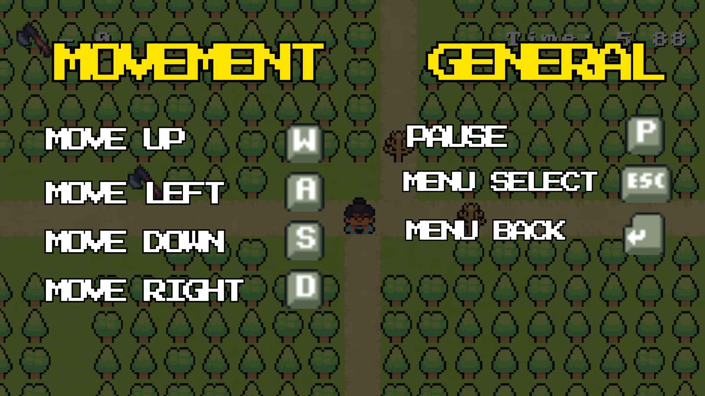

<h1 align = "center">Treasure Rush</h1>
<h3 align = "center">A treasure hunting game.</h3>

<b>CS 2105 </b>  
Manalo, John Danver Z.  
Mendoza, Goldwyn Daine Kierzene D.  
Villegas, Lemuel L.

# Project Description

Treasure Rush is a simple 2D Java game where you explore, avoid monsters, collect axes, and clear obstacles to find the treasure hidden somewhere on the map.

## 🎮 How to Play

### 🕹️ Controls

### 🎯 Objectives

#### 1. Explore the map filled with:

&nbsp;&nbsp;&nbsp;🌳    Trees

&nbsp;&nbsp;&nbsp;👾    Monsters

&nbsp;&nbsp;&nbsp;🧪    Speed Potions

&nbsp;&nbsp;&nbsp;🗺️    Hidden Treasures

#### 2. Collect Axes

- Axes are required to cut down obstacles blocking your path.

- Each tree cut consumes 1 axe from the inventory.

#### 3. Navigate the map
- Travel through the map to find the hidden treasure in the woods.

- The level ends once you found the hidden treasure. The game will take you back to the Title Screen.

## ⚙️ Game Features
- 2D top-down movement

- WASD controls

- Monster encounters (non-combat)

- Collectible treasure

- Resource management (axes)

- Obstacle-cutting mechanic

- Hidden treasure win condition

- Title screen and game loop

## Project Structure

A step by step series of examples that tell you how to get a development
environment running

Say what the step will be

    Give the example

And repeat

    until finished

End with an example of getting some data out of the system or using it
for a little demo

## OOP Principles

### 💊 Encapsulation
Encapsulation was used in this project in a way that the game data such as player stats, inventory (axes), position, and movement speed are stored in private fields. Access of these are controlled
through getter and setter methods. 

This protects the game state from unwanted modifications and keeps data handling organized.

### 🧬 Inheritance

Text

### 👁️‍🗨️ Abstraction

Text

### 🎭 Polymorphism

Text

## 👥 Contributors

<table style="border-collapse: collapse; width: 110%;">
  <tr>
    <th style="border: 1px solid #999; padding: 12px; text-align: left; width: 50%;">Name</th>
    <th style="border: 1px solid #999; padding: 12px; text-align: center; width: 50%;">&nbsp;</th>
  </tr>

  <tr>
    <td style="border: 1px solid #999; padding: 15px; font-size: 16px;">
      <strong>Manalo, John Danver Z.</strong>
    </td>
    <td style="border: 1px solid #999; padding: 15px; text-align: center;">
      
    </td>
  </tr>

  <tr>
    <td style="border: 1px solid #999; padding: 15px; font-size: 16px;">
      <strong>Mendoza, Goldwyn Daine Kierzene D.</strong>
    </td>
    <td style="border: 1px solid #999; padding: 15px; text-align: center;">
      
    </td>
  </tr>

  <tr>
    <td style="border: 1px solid #999; padding: 15px; font-size: 16px;">
      <strong>Villegas, Lemuel L.</strong>
    </td>
    <td style="border: 1px solid #999; padding: 15px; text-align: center;">
      
    </td>
  </tr>
</table>

### pp

Checks if the best practices and the right coding style has been used.

    Give an example

## Deployment

Add additional notes to deploy this on a live system

## Built With

  - [Contributor Covenant](https://www.contributor-covenant.org/) - Used
    for the Code of Conduct
  - [Creative Commons](https://creativecommons.org/) - Used to choose
    the license

## Versioning

We use [Semantic Versioning](http://semver.org/) for versioning. For the versions
available, see the [tags on this
repository](https://github.com/PurpleBooth/a-good-readme-template/tags).

## Acknowledgments

  - Hat tip to anyone whose code is used
  - Inspiration
  - etc

